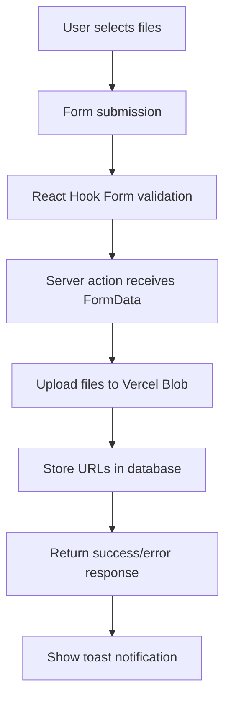

# Social Links Create Form Documentation

## Overview

This document explains the complete dataflow and architecture of the Social Links Create form, including frontend form handling and backend file upload processing.

## Architecture

### Frontend Component: `SocialLinksCreate`
- **Location**: `/src/app/(admin)/admin/social-links/_components/social-links-create.tsx`
- **Form Library**: React Hook Form with Zod validation
- **UI Components**: Shadcn/ui components with Controller pattern

### Backend Server Action: `createSocialLinks`
- **Location**: `/src/actions/social-links-actions.ts`
- **File Storage**: Vercel Blob storage
- **Database**: Prisma ORM with PostgreSQL

## Data Flow



## Frontend Implementation

### Form Structure

The form uses `react-hook-form` with `Controller` components for each field:

```typescript
const form = useForm<z.infer<typeof SocialLinksFormSchema>>({
  mode: "onBlur",
  resolver: zodResolver(SocialLinksFormSchema),
  defaultValues: {
    gmailLabel: "",
    gmailUrl: "",
    gmailIcon: undefined,
    gmailSortOrder: "0",
    // ... similar for linkedin, whatsapp, messenger
  },
});
```

### Field Types

Each social link has 4 fields:
- **Label**: String input for display name
- **URL**: String input with URL validation
- **Icon**: File input for image upload
- **Sort Order**: String input for ordering

### File Input Handling

File inputs require special handling because they can't be controlled like text inputs:

```typescript
<Controller
  name="gmailIcon"
  control={form.control}
  render={({ field, fieldState }) => (
    <Field className="mb-8" data-invalid={fieldState.invalid}>
      <FieldLabel htmlFor={field.name}>Icon (SVG/PNG)</FieldLabel>
      <Input
        id={field.name}
        aria-invalid={fieldState.invalid}
        type="file"
        accept="image/*,image/svg+xml"
        onChange={(e) => field.onChange(e.target.files?.[0])}
        onBlur={field.onBlur}
      />
      {fieldState.invalid && (
        <FieldError className="text-red-500 -mt-1" errors={[fieldState.error]} />
      )}
    </Field>
  )}
/>
```

**Key Points:**
- `{...field}` is NOT used for file inputs (causes TypeScript errors)
- Custom `onChange` extracts `File` object from `e.target.files?.[0]`
- `onBlur` is still handled by `field.onBlur`

## Backend Implementation

### Server Action Signature

```typescript
export async function createSocialLinks(formData: SocialLinksFormInput) {
  // File upload + database logic
}
```

### File Upload Process

1. **Receive File Objects**: Form sends `File` objects for icon fields
2. **Upload to Vercel Blob**: Each file is uploaded with unique filename
3. **Get Public URL**: Vercel returns accessible URL
4. **Store URL**: Database stores the URL (not the file itself)

```typescript
async function uploadIcon(file: File | undefined): Promise<string | undefined> {
  if (!file || file.size === 0) return undefined;
  
  const blob = await put(`social-icons/${Date.now()}-${file.name}`, file, {
    access: "public",
  });
  return blob.url;
}
```

### Data Transformation

Form data is transformed into database format:

```typescript
const items: SocialLinkItemInput[] = [
  {
    label: formData.gmailLabel,
    url: formData.gmailUrl,
    icon: await uploadIcon(formData.gmailIcon), // Uploaded file URL
    sortOrder: parseInt(formData.gmailSortOrder) || 0,
  },
  // ... similar for other platforms
];
```

### Validation

Each item is validated against `SocialLinkItemSchema`:

```typescript
const validatedItems = items.map((item) => {
  const parsed = SocialLinkItemSchema.safeParse(item);
  if (!parsed.success) {
    const msg = parsed.error.issues
      .map((issue) => issue.message)
      .join(", ");
    throw new Error(msg);
  }
  return parsed.data;
});
```

### Database Storage

Validated items are stored using Prisma:

```typescript
await prisma.socialLink.createMany({
  data: validatedItems.map((i) => ({
    label: i.label,
    url: i.url,
    icon: i.icon, // URL from Vercel Blob
    sortOrder: i.sortOrder,
    profileId: profile?.id ?? null,
  })),
  skipDuplicates: true,
});
```

## Schema Definitions

### Form Schema: `SocialLinksFormSchema`

```typescript
export const SocialLinksFormSchema = z.object({
  gmailLabel: z.string().min(1, "Gmail label is required").trim(),
  gmailUrl: z.url("Invalid Gmail URL").trim(),
  gmailIcon: z.instanceof(File).optional(),
  gmailSortOrder: z.string().min(0, "Sort order must be a positive integer"),
  // ... similar for other platforms
});
```

### Item Schema: `SocialLinkItemSchema`

```typescript
export const SocialLinkItemSchema = z.object({
  label: z.string().min(1, "Label is required").trim(),
  url: z.url("Invalid URL").trim(),
  icon: z.url("Invalid icon URL").optional(),
  sortOrder: z.number().min(0, "Sort order must be a positive integer"),
});
```

## Error Handling

### Frontend Validation
- Real-time validation using Zod schema
- Field-level error display with `FieldError` components
- Form-level errors shown below submit button

### Backend Validation
- Server-side validation for each social link item
- Consolidated error messages thrown as exceptions
- Error responses returned with consistent structure:

```typescript
return {
  success: false,
  type: "server-error",
  message: "Failed to create social links",
  error: { type: "unknown", code: "SOCIAL_LINKS_CREATE_FAILED" },
};
```

## File Upload Details

### Supported Formats
- **Images**: `image/*` (JPEG, PNG, GIF, WebP)
- **SVG**: `image/svg+xml`
- **Max Size**: Limited by Vercel Blob (default 25MB)

### Storage Location
- **Path**: `social-icons/{timestamp}-{filename}`
- **Access**: Public (accessible via URL)
- **Naming**: Timestamp prefix prevents conflicts

### URL Generation
```typescript
// Example uploaded URL
https://your-vercel-app-domain.vercel.app/social-icons/1704928356789-gmail-icon.svg
```

## Usage Instructions

### For Developers
1. **Form Setup**: Import `SocialLinksCreate` component
2. **Styling**: Uses existing design system classes
3. **Validation**: Client and server-side validation included
4. **Error Handling**: Toast notifications for success/error states

### For Content Managers
1. **Fill Form**: Enter labels, URLs, and select icons
2. **Upload Icons**: Choose SVG or PNG files for each platform
3. **Set Order**: Use sort order to control display sequence
4. **Submit**: Click "Save social links" button

## Security Considerations

- **File Type Validation**: Only accepts image files
- **File Size**: Limited by Vercel Blob storage
- **URL Validation**: Zod validates URL format on both client and server
- **Database**: Uses parameterized queries to prevent SQL injection

## Performance Notes

- **Parallel Uploads**: Files uploaded sequentially (can be parallelized if needed)
- **Database**: Uses `createMany` for bulk insertion
- **Validation**: Fast-fail approach with early error throwing
- **Client State**: React Hook Form optimizes re-renders

## Troubleshooting

### Common Issues
1. **File Upload Fails**: Check Vercel Blob configuration
2. **Validation Errors**: Ensure URLs are properly formatted
3. **Type Errors**: File inputs require special handling (see implementation)
4. **Database Errors**: Check Prisma connection and schema

### Debug Steps
1. Check browser console for `console.log(data)` output
2. Verify file uploads in Vercel dashboard
3. Check database records for stored URLs
4. Test form validation with empty/invalid inputs
